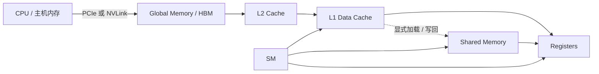

# CUDA 架构与编程<span class="animated-dot"></span>

CUDA 的很多优化，最后都会落到两个问题上：线程怎样被组织和调度，以及数据怎样在不同层级的内存之间流动。

> 说明：下面的代码以 CUDA C++ 为例，重点是展示知识点，省略了大部分错误检查。不同 GPU 架构的 SM 组成、缓存容量、内存事务和 Tensor Core 支持会有差异，实际优化时要以目标 GPU 的文档和测量结果为准。

## 一、SM、分区与计算单元

SM（Streaming Multiprocessor，流多处理器）有一个 L1 缓存/共享内存区域和多个分区。不同架构的具体组织方式和容量会变化，不能用一个固定数字概括所有 GPU。

在很多架构中，L1 Data Cache 和 Shared Memory 使用同一块片上资源，但它们在 CUDA 编程模型中的用途不同：L1 主要由硬件自动缓存全局内存访问，共享内存则需要程序员显式申请和读写。

每个分区由一组寄存器、一组 CUDA 核心、DP（双精度浮点数）运算单元、一组 Tensor Core，以及计算特殊复杂函数的 SFU 组成。严谨地说，CUDA Core 通常指执行普通 FP32 运算的流处理器（Stream Processor）；Tensor Core 负责矩阵乘加，SFU 则负责一部分特殊函数。具体执行单元的数量和分布依 GPU 型号而变化。

所以，CUDA 核心不是一个完全相同的“计算器”：常规整数运算、FP32/FP64 运算、矩阵乘加和复杂函数，可能会被调度到不同的执行资源。




下面的例子把整数索引、普通 FP32 运算和特殊函数放在一个内核中：

```cpp
#include <cuda_runtime.h>

__global__ void arithmetic_demo(const float* x, float* y, int n) {
    // 这里的索引计算主要是整数运算。
    int i = blockIdx.x * blockDim.x + threadIdx.x;

    if (i < n) {
        float v = x[i];              // 从全局内存读取
        v = v * 2.0f + 1.0f;         // 普通 FP32 运算
        y[i] = __sinf(v);            // sinf 的设备端版本
    }
}
```

复杂数学函数通常会使用 SFU 或相关的专用执行路径，但最终生成哪些指令仍然由编译器和目标架构决定。

Tensor Core 的一个最小化示例可以使用 WMMA 接口。这个例子让一个 warp 完成一个 16×16×16 的矩阵乘加：

```cpp
#include <cuda_fp16.h>
#include <mma.h>

using namespace nvcuda;

__global__ void tensor_core_demo(const half* a, const half* b, float* c) {
    // 一个 WMMA fragment 通常由一个 warp 协作使用。
    if (threadIdx.x >= warpSize) {
        return;
    }

    wmma::fragment<wmma::matrix_a, 16, 16, 16, half, wmma::row_major> a_frag;
    wmma::fragment<wmma::matrix_b, 16, 16, 16, half, wmma::col_major> b_frag;
    wmma::fragment<wmma::accumulator, 16, 16, 16, float> c_frag;

    wmma::fill_fragment(c_frag, 0.0f);
    wmma::load_matrix_sync(a_frag, a, 16);
    wmma::load_matrix_sync(b_frag, b, 16);
    wmma::mma_sync(c_frag, a_frag, b_frag, c_frag);
    wmma::store_matrix_sync(c, c_frag, 16, wmma::mem_row_major);
}
```

实际使用 WMMA 时，还要确认目标架构、数据布局、地址对齐和矩阵步长；上面只是为了说明 Tensor Core 的调用方式。

## 二、内存层次与数据搬运

显存（例如 HBM）和 L2 Cache 由所有 SM 共享。全局内存访问可能命中 L2 或 L1，也可能继续访问显存；共享内存不是“自动经过”的一层，而是程序员显式把数据搬进去、在片上复用，再写回结果。

可以先用下面这张表建立一个大致的层次感：

| 存储层级 | 作用域 | 典型特点 | 常见用途 |
| --- | --- | --- | --- |
| 寄存器 | 单个 Thread | 延迟低、容量小 | 保存线程自己的中间变量 |
| Shared Memory | 同一个 Block | 片上、可编程、需要同步 | Block 内数据复用、线程协作 |
| L1 Data Cache | 通常靠近 SM | 硬件自动管理 | 缓存部分全局内存访问 |
| L2 Cache | 整个 GPU | 多个 SM 共享 | 缓存全局内存、跨 SM 数据复用 |
| Global Memory / HBM | 整个 GPU | 容量大、访问延迟高 | 存放大规模输入和输出 |
| Host Memory | CPU | 通过 PCIe/NVLink 与 GPU 连接 | 输入准备、结果回收 |

磁盘数据先进入主机内存，再由 CPU 通过 PCIe 等总线搬运到 HBM。NVLink 可以直接连接多张显卡，在支持的平台上通常比 PCIe 有更高的互联带宽，但实际速度仍取决于 GPU、拓扑和传输方向。

下面是一个把全局内存数据先搬到共享内存，再由线程读取的例子：

```cpp
__global__ void add_with_shared(const float* x, float* y, int n) {
    extern __shared__ float tile[];

    int local_id = threadIdx.x;
    int global_id = blockIdx.x * blockDim.x + local_id;

    tile[local_id] = (global_id < n) ? x[global_id] : 0.0f;
    __syncthreads();

    if (global_id < n) {
        // 这里可以反复使用 tile 中的数据。
        y[global_id] = tile[local_id] + 1.0f;
    }
}

// add_with_shared<<<grid, block, block.x * sizeof(float)>>>(x, y, n);
```

主机内存和显存之间的基本搬运方式如下：

```cpp
float* d_x = nullptr;
const size_t bytes = n * sizeof(float);

cudaMalloc(&d_x, bytes);
cudaMemcpy(d_x, h_x, bytes, cudaMemcpyHostToDevice);

// 使用 d_x 启动内核……

cudaMemcpy(h_y, d_y, bytes, cudaMemcpyDeviceToHost);
cudaFree(d_x);
```

如果平台支持 GPU Peer Access，也可以在 GPU 之间直接拷贝：

```cpp
int can_access = 0;
cudaDeviceCanAccessPeer(&can_access, 0, 1);

if (can_access) {
    cudaSetDevice(0);
    cudaDeviceEnablePeerAccess(1, 0);

    // d_on_gpu_1 是设备 1 上的指针，d_on_gpu_0 是设备 0 上的指针。
    cudaMemcpyPeer(d_on_gpu_1, 1, d_on_gpu_0, 0, bytes);
}
```

## 三、Thread、Block 与 Warp

指令的发出以 warp 为基本单位，warp 是 32 个线程。代码中尽量使用 warpSize 表达这个事实，而不是把 32 散落在所有逻辑里。

内核启动函数的完整形式是：

```cpp
kernel<<<gridDim, blockDim, sharedMemBytes, stream>>>(arguments);
```

- **Block**：一个线程块会被整体调度到一个 SM 上执行，Block 内的线程可以共享 Shared Memory 并使用 __syncthreads() 协作。Block 不会被拆到多个 SM 上同时执行。
- **Thread**：Thread 是 CUDA 编程模型中的最小执行实例，它拥有自己的寄存器和线程索引。Thread 不等于一颗物理 CUDA Core；硬件会以 warp 为单位，把线程映射到可用的执行资源上。
- **Warp**：一个 Block 会被划分成多个 warp，warp 中的线程通常执行同一条指令，这就是 SIMT（Single Instruction, Multiple Threads）。

可以用下面的内核观察线程、warp 和 lane 的编号：

```cpp
__global__ void show_thread_ids() {
    int global_id = blockIdx.x * blockDim.x + threadIdx.x;
    int lane = threadIdx.x % warpSize;
    int warp_in_block = threadIdx.x / warpSize;

    printf("block=%d thread=%d global=%d warp=%d lane=%d\n",
           blockIdx.x, threadIdx.x, global_id, warp_in_block, lane);
}
```

最常见的一维向量运算可以这样写：

```cpp
__global__ void saxpy(int n, float a, const float* x, float* y) {
    int i = blockIdx.x * blockDim.x + threadIdx.x;
    if (i < n) {
        y[i] = a * x[i] + y[i];
    }
}

int block_size = 256;
int grid_size = (n + block_size - 1) / block_size;
saxpy<<<grid_size, block_size>>>(n, 2.0f, d_x, d_y);
```

## 四、指令执行与同步

一个 Thread 在本质上是一系列指令，比如第一步做加法，第二步算正弦，第三步做乘法。

遇到常规整数运算（如内存索引计算）$\rightarrow$ 调度器派发给 INT32 执行单元执行。

遇到常规浮点运算（如单精度乘加法）$\rightarrow$ 调度器派发给 FP32 CUDA 核心执行。

遇到复杂数学函数（如 sin、cos、log、exp）$\rightarrow$ 调度器派发给 SFU 或相关专用路径执行。

遇到矩阵乘加运算（深度学习的核心操作）$\rightarrow$ 调度器派发给 Tensor Core 执行。

__syncthreads() 只管**同一个 Block 内部**的线程：所有参与的线程到达这个屏障之后，才能继续运行下面的代码。它不是整个 Grid 的全局同步。

例如，先把每个线程的数据放入共享内存，再进行 Block 内规约：

```cpp
__global__ void block_sum(const float* input, float* block_output, int n) {
    extern __shared__ float shared[];

    unsigned int tid = threadIdx.x;
    unsigned int i = blockIdx.x * blockDim.x + tid;
    shared[tid] = (i < n) ? input[i] : 0.0f;

    __syncthreads();

    for (unsigned int stride = blockDim.x / 2; stride > 0; stride >>= 1) {
        if (tid < stride) {
            shared[tid] += shared[tid + stride];
        }
        __syncthreads();
    }

    if (tid == 0) {
        block_output[blockIdx.x] = shared[0];
    }
}
```

如果只有部分线程进入 __syncthreads()，就可能造成未定义行为甚至死锁，所以不能把它随意放在会分叉的条件分支中。

## 五、延迟隐藏

GPU 访问全局内存、等待数据返回时会有很大的延迟。GPU 不会让整个 SM 站在那里空等，而是让调度器在一个 warp 等待时切换到其他已经准备好的 warp，这就是延迟隐藏。

```cpp
__global__ void latency_hiding_example(const float* x, float* y, int n) {
    int i = blockIdx.x * blockDim.x + threadIdx.x;

    if (i < n) {
        float value = x[i];       // 这一步可能等待显存访问
        value = value * value;
        y[i] = value + 1.0f;     // 等待期间，SM 可以执行其他 ready warp
    }
}
```

想让更多 warp 同时驻留在 SM 上，需要在寄存器、共享内存和线程数之间做平衡。占用率（occupancy）高不一定等于性能一定高，但寄存器或共享内存用量过大，确实会限制可同时驻留的 warp 数量。

## 六、Global Memory 与合并访问

GPU 全局内存（Global Memory）访存优化的终极圣杯——完美的内存合并访问（Coalesced Memory Access）。

一个 warp 中的线程如果访问连续或相邻的数据，硬件可以把这些请求合并成较少的内存事务；如果每个线程跳到完全不同的位置，就会产生毁灭性的随机访问（Scattered Requests），带宽利用率会明显下降。

具体事务大小、缓存是否绕过 L1，以及请求如何被分割，会随着 GPU 架构和 cache policy 变化。因此，不能把“总线搬运数据的最小集装箱”固定写成所有 GPU 都是 128 字节或 32 字节；实际情况应该结合目标架构和 profiler 判断。

合并访问的例子：

```cpp
__global__ void coalesced_read(const float* x, float* y, int n) {
    int i = blockIdx.x * blockDim.x + threadIdx.x;
    if (i < n) {
        // 相邻线程访问相邻 float，通常更容易形成合并访问。
        y[i] = x[i] * 2.0f;
    }
}
```

随机访问的例子：

```cpp
__global__ void scattered_read(const float* x, float* y, int n, int stride) {
    int i = blockIdx.x * blockDim.x + threadIdx.x;
    if (i < n) {
        int index = (i * stride) % n;
        // stride 较大时，相邻线程可能访问相距很远的位置。
        y[i] = x[index] * 2.0f;
    }
}
```

## 七、Shared Memory、Bank 与 Padding

GPU 的共享内存（Shared Memory）之所以快，是因为它在硬件上被分成了 32 个可以同时独立读写的物理部件，叫做 Banks（就像银行网点里并排开张的 32 个服务柜台，从 Bank 0 到 Bank 31）。

共享内存在物理上并排架设了 32 个独立的存储体（Banks）。对常见的 32-bit 数据来说，连续的 32-bit word 通常映射到连续的 bank。一个 warp 的线程如果同时访问不同 bank，就可以并行服务；如果多个线程访问同一个 bank 的不同地址，就会产生 Bank Conflict。

矩阵转置是观察 Bank Conflict 的经典例子。下面的数组宽度是 32，转置读取时容易让一个 warp 的线程集中访问同一个 bank：

```cpp
__global__ void transpose_bad(const float* input, float* output,
                              int width, int height) {
    __shared__ float tile[32][32];

    int tx = threadIdx.x;
    int ty = threadIdx.y;
    int x = blockIdx.x * 32 + tx;
    int y = blockIdx.y * 32 + ty;

    if (x < width && y < height) {
        tile[ty][tx] = input[y * width + x];
    }
    __syncthreads();

    // 这里按列读取 tile，典型情况下容易发生 bank conflict。
    int out_x = blockIdx.y * 32 + tx;
    int out_y = blockIdx.x * 32 + ty;
    if (out_x < height && out_y < width) {
        output[out_y * height + out_x] = tile[tx][ty];
    }
}
```

终极解法是：把矩阵的申请宽度从 32 改成 33（即 32×33 的 SMEM array）。我们在每一行的末尾，人为地塞入一个根本不放有效数据的“空柜台”——Padding。这样下一行会错开一个 bank：

```cpp
__global__ void transpose_padded(const float* input, float* output,
                                 int width, int height) {
    __shared__ float tile[32][33];  // 多出来的一列就是 padding

    int tx = threadIdx.x;
    int ty = threadIdx.y;
    int x = blockIdx.x * 32 + tx;
    int y = blockIdx.y * 32 + ty;

    if (x < width && y < height) {
        tile[ty][tx] = input[y * width + x];
    }
    __syncthreads();

    int out_x = blockIdx.y * 32 + tx;
    int out_y = blockIdx.x * 32 + ty;
    if (out_x < height && out_y < width) {
        output[out_y * height + out_x] = tile[tx][ty];
    }
}
```

## 八、Atomic 操作

原子指令解决的是多个线程同时更新同一个地址的问题。如果多个线程要把结果写入某个相同地址，硬件会保证一次读-改-写操作的原子性；冲突的更新需要排队执行。

例如，用原子加法统计直方图：

```cpp
__global__ void histogram(const unsigned char* data, int* bins, int n) {
    int i = blockIdx.x * blockDim.x + threadIdx.x;
    if (i < n) {
        unsigned char value = data[i];
        atomicAdd(&bins[value], 1);
    }
}
```

原子操作保证的是更新不丢失，不代表所有线程会在这里同步，也不代表冲突访问没有代价。热点地址越集中，串行化越明显，实际优化中常见的办法是先做每个 Block 的局部直方图，再合并到全局结果。

## 九、连续寻址规约

连续寻址规约是并行规约优化算子（Parallel Reduction）的一种写法，负责“内功”：它解决的是“临门一脚”的问题。

它假设数据已经躺在共享内存里了，而且数据量刚好和线程块一样大（比如 256 个数），然后用逐步减半的方式，把这 256 个数熔炼成 1 个数。下面的访问方式是连续的，通常不会产生典型的 Shared Memory Bank Conflict：

```cpp
__global__ void reduce_block(const float* input, float* partials, int n) {
    extern __shared__ float shared[];

    unsigned int tid = threadIdx.x;
    unsigned int i = blockIdx.x * blockDim.x + tid;
    shared[tid] = (i < n) ? input[i] : 0.0f;
    __syncthreads();

    for (unsigned int stride = blockDim.x / 2;
         stride > 0;
         stride >>= 1) {
        if (tid < stride) {
            shared[tid] += shared[tid + stride];
        }
        __syncthreads();
    }

    if (tid == 0) {
        partials[blockIdx.x] = shared[0];
    }
}
```

这个内核每个 Block 只产生一个部分和；如果整个数组有很多 Block，还需要继续规约 partials。生产环境中也可以直接使用 CUB 或 Cooperative Groups 提供的规约实现，避免重复维护边界和性能细节。

## 十、网格跨步循环（Grid-Stride Loops）

网格跨步循环的核心就是：

```cpp
idx += gridDim.x * blockDim.x;
```

完整写法如下：

```cpp
__global__ void scale_grid_stride(float* data, int n, float factor) {
    for (int idx = blockIdx.x * blockDim.x + threadIdx.x;
         idx < n;
         idx += gridDim.x * blockDim.x) {
        data[idx] *= factor;
    }
}
```

当第一轮循环结束时，所有的线程同时向右跨越了一个“网格宽度”的距离。当它们执行完 idx += gridDim.x * blockDim.x 发生跳跃后，如果 blockDim.x 是 warpSize 的整数倍，跳跃后的新地址仍然保持着良好的相对连续性。

它解决的是“海量吞吐”的问题。如果大山有 1000 万个元素，共享内存根本装不下，它负责用合并访问的“大刷子”去显存里扫描，把这 1000 万个元素安全地运进来，并在每个线程上完成处理。它不要求一次性把所有数据塞进共享内存。

## 十一、Warp Shuffle

Warp Shuffle 让不同的线程之间实现直接通信，可以减少共享内存的使用。它是在 warp 内交换寄存器中的值，不需要先写入共享内存，也不等同于一个 Block 级别的同步。

下面用 __shfl_down_sync 做一个 warp 内求和：

```cpp
__global__ void warp_sum(const float* input, float* output, int n) {
    int i = blockIdx.x * blockDim.x + threadIdx.x;
    int lane = threadIdx.x % warpSize;

    float value = (i < n) ? input[i] : 0.0f;
    unsigned int mask = 0xffffffffu;  // 这个例子中整个 warp 都参与

    for (int offset = warpSize / 2; offset > 0; offset >>= 1) {
        value += __shfl_down_sync(mask, value, offset);
    }

    if (lane == 0) {
        atomicAdd(output, value);
    }
}
```

使用 shuffle 时，mask 必须和实际参与通信的 lane 相匹配；如果线程发生分支分叉，不能不加判断地使用全 warp mask。

## 十二、CUDA 统一内存

统一内存（Unified Memory）让 CPU 和 GPU 共享一个统一的地址空间。它解决的是“指针和数据搬运很复杂”的问题，但不代表 CPU 和 GPU 永远在同一块物理内存上读写。

### 1. 按需自动页迁移（Page Faulting）

用 cudaMallocManaged 申请了内存后，程序拿到的是 CPU 和 GPU 都能使用的统一地址。数据具体驻留在 CPU 内存还是 GPU 显存，会由 CUDA 运行时和驱动根据访问情况管理。

当 CPU 读写这个指针时，数据可能驻留在 CPU 内存里；当 GPU 开始运行核函数并访问这个指针时，如果所需页面不在显存里，就可能触发缺页处理。CUDA 驱动程序会把 GPU 需要的数据通过 PCIe 或 NVLink 等总线迁移到显存中。之后 CPU 再次访问时，也可能发生反向迁移。这对程序员来说是透明的，但迁移本身并不是免费的。

```cpp
__global__ void increment_managed(float* data, int n) {
    int i = blockIdx.x * blockDim.x + threadIdx.x;
    if (i < n) {
        data[i] += 1.0f;
    }
}

float* data = nullptr;
size_t bytes = n * sizeof(float);
cudaMallocManaged(&data, bytes);

for (int i = 0; i < n; ++i) {
    data[i] = static_cast<float>(i);  // CPU 初始化
}

int device = 0;
cudaGetDevice(&device);
cudaMemPrefetchAsync(data, bytes, device, 0);  // 提前迁移，减少缺页
increment_managed<<<(n + 255) / 256, 256>>>(data, n);
cudaDeviceSynchronize();

cudaMemPrefetchAsync(data, bytes, cudaCpuDeviceId, 0);
cudaDeviceSynchronize();
cudaFree(data);
```

### 2. 支持显存超分（Oversubscription）

在传统模式下，如果你的 GPU 显存只有 16GB，而你的数据集有 32GB，直接用 cudaMalloc 申请 32GB 通常会因为显存不足而失败。

在支持的系统和 GPU 上，统一内存可以像虚拟内存一样，把暂时用不到的数据留在 CPU 内存里，只把当前计算需要的页面换入显存。这意味着程序有机会使用比物理显存容量大的数据集，但页面来回迁移会显著降低速度；它也不是“程序绝不会崩溃”的保证，分配、访问权限和系统可用内存仍然可能成为限制。

类比虚拟内存的实现：内存空间不足时，可以通过磁盘空间虚拟出来；这里显存不足时，可以通过主机内存承接暂时不用的数据。

```cpp
// 在支持 oversubscription 的平台上，这个分配可以大于显存容量。
// 但不应把它当成性能优化手段，访问模式不合适时会产生严重 thrashing。
float* large_data = nullptr;
cudaMallocManaged(&large_data, requested_bytes);

cudaMemPrefetchAsync(large_data, working_set_bytes, device, 0);
process<<<grid, block>>>(large_data, element_count);
cudaDeviceSynchronize();
```

### 3. 支持复杂的 C++ 数据结构

在传统模式下，像链表、树、图或者带有指针的 C++ 类，是极难从 CPU 拷贝到 GPU 的，因为指针在 GPU 端可能失效，需要做深拷贝（Deep Copy）。

有了统一内存，由于 CPU 和 GPU 共享相同的虚拟地址空间，链表节点和节点内的指针可以在两端保持可用。你可以直接在 GPU 上遍历在 CPU 侧构建的复杂数据结构。

但这里有一个前提：节点本身和节点里的指针指向的对象，都要分配在 GPU 可访问的内存中。普通 CPU malloc 或 new 得到的指针不会因为结构体被复制过去，就自动变成 GPU 可访问地址。

```cpp
struct Node {
    int value;
    Node* next;
};

__global__ void sum_list(const Node* head, int* result) {
    int sum = 0;
    for (const Node* p = head; p != nullptr; p = p->next) {
        sum += p->value;
    }
    *result = sum;
}

Node* first = nullptr;
Node* second = nullptr;
int* result = nullptr;

cudaMallocManaged(&first, sizeof(Node));
cudaMallocManaged(&second, sizeof(Node));
cudaMallocManaged(&result, sizeof(int));

first->value = 1;
first->next = second;
second->value = 2;
second->next = nullptr;

sum_list<<<1, 1>>>(first, result);
cudaDeviceSynchronize();
// result 的值为 3
```

所以，对于原代码中有指针之类的结构，如果原封不动拷过去，GPU 里面可能仍然是 CPU 的原来指针，不能直接使用。正确做法是重新开辟 GPU 可访问的空间，再分配和修正指针；如果使用 managed，就会方便很多。

## 十三、锁定内存（Pinned Memory）

锁定内存就是让主机的虚拟内存页锁在物理内存里面，不被操作系统换出到磁盘的虚拟内存空间。它常用于 CPU 与 GPU 的异步数据传输。

```cpp
float* h_data = nullptr;
float* d_data = nullptr;
size_t bytes = n * sizeof(float);
cudaStream_t stream;

cudaStreamCreate(&stream);
cudaMallocHost(&h_data, bytes);  // page-locked host memory
cudaMalloc(&d_data, bytes);

cudaMemcpyAsync(d_data, h_data, bytes,
                cudaMemcpyHostToDevice, stream);
kernel<<<grid, block, 0, stream>>>(d_data, n);
cudaMemcpyAsync(h_data, d_data, bytes,
                cudaMemcpyDeviceToHost, stream);

cudaStreamSynchronize(stream);

cudaFree(d_data);
cudaFreeHost(h_data);
cudaStreamDestroy(stream);
```

锁定内存不是“把数据放进显存”，而是保证这块主机内存不会被换出，使 DMA 和异步拷贝能够直接工作。锁定太多主机内存会影响操作系统和其他程序，所以应该按需使用。

## 十四、CUDA Stream

流是可以创建的变量，是一个按照顺序执行的 GPU 操作命令序列。发给同一个流的操作按照提交顺序执行；不同流之间在没有依赖且硬件资源允许时可以并行或重叠。

下面把两个批次分别提交到两个流：

```cpp
cudaStream_t streams[2];
for (int i = 0; i < 2; ++i) {
    cudaStreamCreate(&streams[i]);
}

for (int batch = 0; batch < 2; ++batch) {
    cudaMemcpyAsync(d_batch[batch], h_batch[batch], bytes,
                    cudaMemcpyHostToDevice, streams[batch]);
    kernel<<<grid, block, 0, streams[batch]>>>(d_batch[batch], n);
    cudaMemcpyAsync(h_batch[batch], d_batch[batch], bytes,
                    cudaMemcpyDeviceToHost, streams[batch]);
}

cudaDeviceSynchronize();

for (int i = 0; i < 2; ++i) {
    cudaStreamDestroy(streams[i]);
}
```

这里的异步拷贝使用的是锁定主机内存；是否真的和计算重叠，还取决于 GPU 是否支持并发拷贝、内核资源占用、数据依赖以及默认流的使用方式。

## 十五、Cooperative Groups

Cooperative Groups 提供了一套 C++ 类库和 API，允许你在代码中显式地定义、划分和同步任意大小的线程群体。

例如，可以把一个 Block 划分成多个 32 线程的 tile，并在每个 tile 内做规约：

```cpp
#include <cooperative_groups.h>
#include <cooperative_groups/reduce.h>

namespace cg = cooperative_groups;

__global__ void cooperative_reduce(const float* input,
                                   float* output, int n) {
    cg::thread_block block = cg::this_thread_block();
    auto tile = cg::tiled_partition<32>(block);

    int i = blockIdx.x * blockDim.x + threadIdx.x;
    float value = (i < n) ? input[i] : 0.0f;
    value = cg::reduce(tile, value, cg::plus<float>());

    if (tile.thread_rank() == 0) {
        atomicAdd(output, value);
    }
}
```

这个例子要求 Block 大小适合划分成 32 线程的 tile，并且同一个 collective 中的参与线程必须满足 API 的参与要求。Cooperative Groups 可以表达更清晰的线程协作关系，但它不会自动提供任意 Block 之间的全局同步。

## 最后把这些知识点串起来

可以把 CUDA 的执行过程先记成一条主线：

1. CPU 准备数据，通过 PCIe/NVLink 把数据放到 GPU 可访问的内存中。
2. Grid 被拆成多个 Block，Block 被调度到不同的 SM。
3. Block 内的线程被分成 Warp，以 32 个线程为基本单位执行指令。
4. 线程优先在寄存器中计算；需要协作时使用 Shared Memory、__syncthreads()、Warp Shuffle 或 Cooperative Groups。
5. 访问 Global Memory 时尽量让同一个 Warp 的线程访问连续地址，形成合并访问。
6. 数据规模很大时使用 Grid-Stride Loop；数据更新存在竞争时使用 Atomic，或者重新设计局部累加和规约流程。

这些代码例子故意保持短小，实际工程还需要补充 CUDA error checking、边界检查、正确的内存释放以及针对目标 GPU 的性能测试。CUDA 的很多“看起来更快”的写法，最后都应该用 Nsight Systems、Nsight Compute 或其他 profiler 验证。

### 参考资料

- [NVIDIA CUDA Programming Guide：Programming Model](https://docs.nvidia.com/cuda/cuda-programming-guide/01-introduction/programming-model.html)
- [NVIDIA CUDA Programming Guide：Understanding Memory](https://docs.nvidia.com/cuda/cuda-programming-guide/02-basics/understanding-memory.html)
- [NVIDIA CUDA Programming Guide：Asynchronous Execution](https://docs.nvidia.com/cuda/cuda-programming-guide/02-basics/asynchronous-execution.html)
- [NVIDIA CUDA Programming Guide：Cooperative Groups](https://docs.nvidia.com/cuda/cuda-programming-guide/04-special-topics/cooperative-groups.html)
- [NVIDIA CUDA Pro Tip：Grid-Stride Loops](https://developer.nvidia.com/blog/cuda-pro-tip-write-flexible-kernels-with-grid-stride-loops/)

