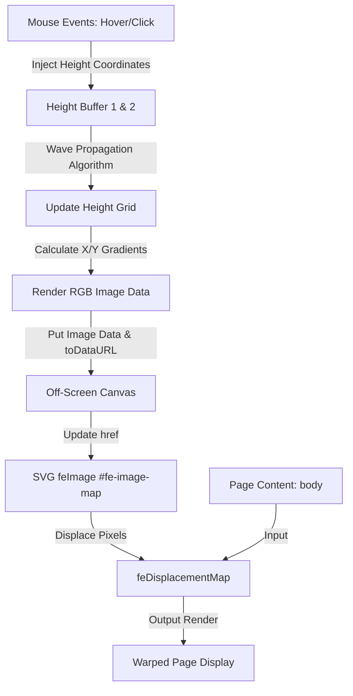

# Interactive Mouse Water Ripple Displacement Filter Design Spec

This document details the design and implementation for adding a full-screen interactive water ripple/depression refraction animation using Canvas 2D and SVG `<feDisplacementMap>` filters.

## Background & Goals
To create a premium, dynamic user experience, the website background and content should react to mouse movements and clicks as if they were on a fluid surface. 
*   **Goal**: Translate mouse pointers and clicks into physical water ripples that refract and deform the actual DOM text, images, and backgrounds at 60 FPS.
*   **Performance Requirement**: Frame time of less than 2ms for fluid calculations to avoid blocking the main thread or causing layout thrashing.

## System Architecture

The design is split into three main components:
1.  **Simulation Grid**: A cellular-automata-based 2D grid (`256 x 256` pixels) storing heightmaps. Runs a lightweight wave propagation algorithm on every frame.
2.  **Displacement Converter**: Computes horizontal and vertical slopes of the heightmap, converts them into Red and Green color values (relative to neutral 128), and renders them onto an off-screen Canvas.
3.  **SVG Filter Pipeline**: Takes the canvas PNG data via `<feImage>` and warps the target graphic (`body` or main wrapper) using `<feDisplacementMap>`.



## Component Details

### 1. The SVG Filter (`_layouts/default.html`)
The filter will be appended to the document body. It defines the mapping parameters:
```xml
<svg style="display: none;">
  <defs>
    <filter id="ripple-filter" x="-10%" y="-10%" width="120%" height="120%">
      <feImage id="fe-image-map" href="" result="map" />
      <feDisplacementMap 
        in="SourceGraphic" 
        in2="map" 
        scale="50" 
        xChannelSelector="R" 
        yChannelSelector="G" />
    </filter>
  </defs>
</svg>
```
*   *Note*: The filter boundary (`x="-10%" y="-10%" width="120%" height="120%"`) is expanded to prevent clipping edges when elements near the viewport boundary are displaced.

### 2. CSS Styles (`style.css`)
We will apply the filter to the entire document body:
```css
body {
    filter: url(#ripple-filter);
    transition: filter 0.3s ease;
}
```

### 3. Simulation Logic (`assets/js/ripple.js`)
We will place the logic in a new asset script `assets/js/ripple.js` (or inline inside the layout file for zero-latency loading. Since this is a Jekyll static blog, keeping it in `assets/js/ripple.js` is clean and maintainable).
The JavaScript will:
*   Maintain `buffer1` and `buffer2` (`Int16Array` for high performance).
*   Add mouse listeners:
    -   `mousemove`: Check coordinates, convert to 256x256 space, inject small wave.
    -   `click`: Inject large wave circle.
*   Run the main loop using `requestAnimationFrame`.

## Verification Plan
*   **Manual Verification**:
    1.  Hover the mouse across the page: verify text and cards gently bend around the pointer.
    2.  Click on the page: verify wave ripples propagate outward and fade away smoothly.
    3.  Measure rendering frame rate using browser developer tools (Performance tab) to ensure it stays locked at 60 FPS/120 FPS.
